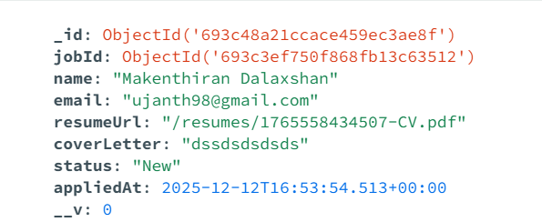
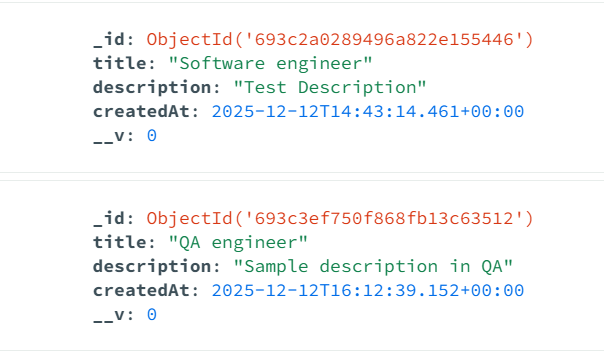

# Application-Tracking

### Features
- Post and view jobs
- Apply with name, email, cover letter + resume upload
- Recruiter dashboard with filtering and status updates
- Resume download with one click
- Data saved in MongoDB
- Resume files stored permanently (Vercel Blob in production)

### Tech Stack
- Next.js 14 + TypeScript
- MongoDB + Mongoose
- Tailwind CSS
- Vercel Blob (file storage)

### Database
## Application

## Job

### API Endpoints (Test with Postman )
# 1. Get All Jobs
textGET http://localhost:3000/api/jobs
JSON[
  {
    "_id": "67a1b2c3d4e5f67890abcdef",
    "title": "Senior React Developer",
    "description": "5+ years experience..."
  }
]

# 2. Create Job
textPOST http://localhost:3000/api/jobs
Content-Type: application/json

{ "title": "Backend Engineer", "description": "Node.js + TypeScript" }

# 3. Submit Application (with resume)
textPOST http://localhost:3000/api/applications
Content-Type: multipart/form-data

Form-data:
- jobId: 67a1b2c3d4e5f67890abcdef
- name: Jane Doe
- email: jane@example.com
- coverLetter: I am excited to apply...
- resume: (upload file.pdf)

# 4. Get All Applications
textGET http://localhost:3000/api/applications
→ Returns applications with populated job title

# 5. Update Status
textPUT http://localhost:3000/api/applications
Content-Type: application/json

{ "id": "67b2c3d4e5f67890abcdef12", "status": "Interview" }